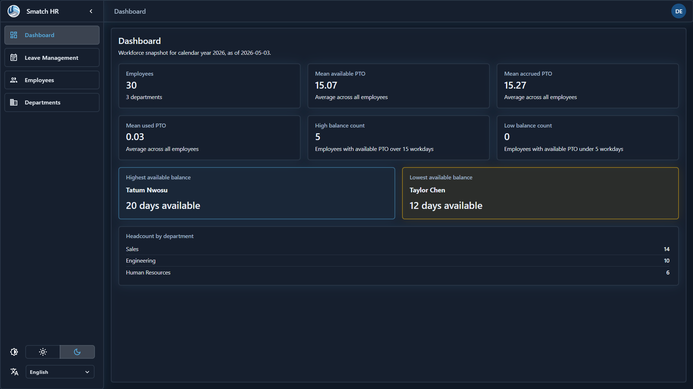

# Smatch HR



Simplified enterprise-style HR dashboard built with **React**, **MUI**, and **.NET 8** — a small toy project for practicing the stack end to end (Vite + TypeScript front end, ASP.NET Core REST API, SQLite).

### Dashboard

High-level workforce snapshot: KPI-style cards built from department PTO data (headcount, balances, simple thresholds) so you can sanity-check the org at a glance.

### Employees

- **Directory** — searchable grid of people with department context.
- **Onboard / edit / remove** — forms wired to the API for creating and updating records and taking someone off the roster (with validation and feedback patterns you’d reuse in a real HR tool).

### Departments

Browse and maintain department metadata used throughout employees and reporting-style views.

### Leave

- **Ledger** — record and inspect PTO movements (accruals, adjustments, usage) per employee.
- **Lookup** — calendar-oriented view to see who is out and when, without digging through raw ledger rows.

### Auth & account

JWT-backed login against the API; session-aware navigation. Account-side tweaks (where exposed) persist through the usual REST flows.

### Shell & UX

Material UI layout with **light / dark** theme switching and **English / Czech** UI strings (plus aligned date formats for pickers and grids).

## Run locally

1. **API** — from `backend/HrDashboard.Api`:

   ```bash
   dotnet run
   ```

   Default URL: `http://localhost:5228` (Swagger: `/swagger`).

2. **Frontend** — from `frontend`:

   ```bash
   npm install
   npm run dev
   ```

   The dev server proxies `/api` to the backend above.

Requires [.NET 8 SDK](https://dotnet.microsoft.com/download) and Node.js (npm).
